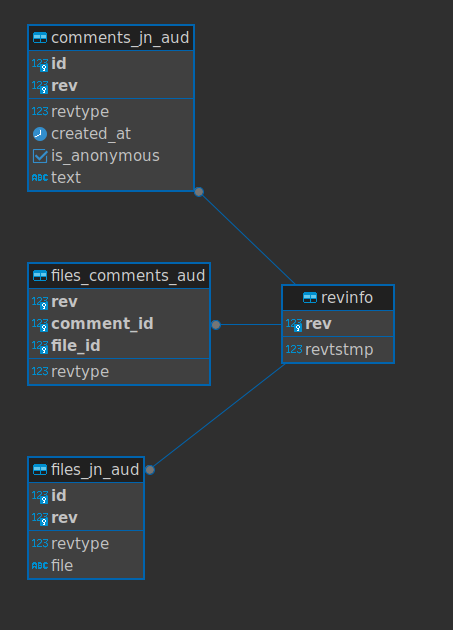
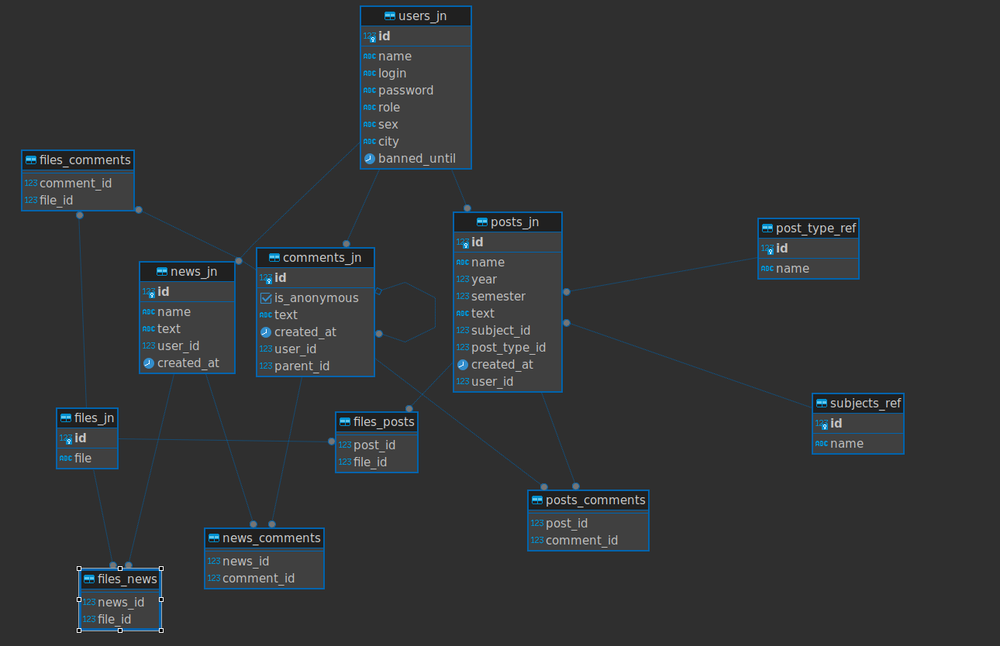

# Старт сервиса
* ./mvnw clean package -DskipTests (Или иной способ собрать Jar файл в папке target)
* docker compose up

# Полезная информация
.properties
http://localhost:8080/swagger-ui/index.html

# Схемы БД

